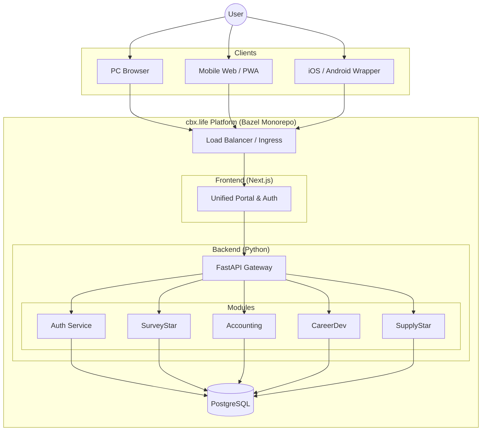

# Implementation Plan - cbx.life (慈贝瑆.生活)

## Branding

## UI/UX Design System

- **Primary Color (Compassion Purple)**: `#7A65B4` (Muted Violet)
- **Secondary Color (Warm Gray)**: `#86817E`
- **Design Philosophy**: Minimalist, universally approachable, "Life & Compassion".
- **Typography**: Clean, rounded sans-serif (e.g., Inter or Outfit).

## Goal

Build a unified 2C platform "cbx.life" accessible via PC, Mobile Web, and Native Apps (iOS/Android wrappers). The platform aims to bring AI convenience to the working class.

## Architecture

- **Build System**: Bazel (Monorepo)
- **Backend**: Python (FastAPI/Django) - *To be confirmed based on "pytest" preference*
- **Frontend**: Next.js (React) - *Optimized for Responsive & PWA*
- **Database**: PostgreSQL (Confirmed)
- **Mobile Strategy**: Responsive Web App (PWA) + Capacitor/Expo for Native Wrapping if needed.

## User Review Required
>
> [!IMPORTANT]
> **Ready to Start?**:
> I am ready to start development upon your explicit request.

## Proposed Structure

### Root

- `WORKSPACE` / `MODULE.bazel`
- `server/` (Python Backend)
- `web/` (Next.js Frontend)
- `shared/` (Proto definitions / Shared logic)

## System Architecture

### Modules

1. **Auth**: Unified login (Email, Phone, Google, WeChat?).
2. **Portal**: Dashboard.
3. **SurveyStar (问卷瑆)**: Survey management.
4. **Accounting (代账王)**: Expense tracking, tax, utilities.
5. **CareerDev (工作珄)**: AI job search & apply.
6. **SupplyStar (补给瑆)**: Grocery & habit tracking.

## Verification Plan

### Automated Tests

- `pytest` for Backend.
- `jest` / `playwright` for Frontend.
- Bazel `test` targets.

### Manual Verification

- Mobile responsiveness check (Chrome DevTools Device Mode).
- Touch interaction check.
- Network access via LAN IP (not localhost).
